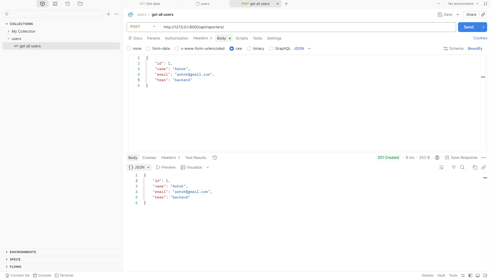
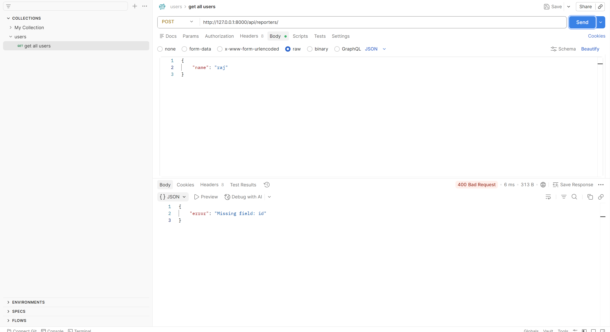

# DevTrack

A minimal Django backend for tracking engineering issues — bugs filed, priorities set, statuses updated.

**Repository:** https://github.com/ashokthamarala/devtrack_assignment

---

## How to Run

```bash
git clone https://github.com/ashokthamarala/devtrack_assignment.git
cd devtrack_assignment

python3 -m venv venv
source venv\scripts\activate 

pip install -r requirements.txt
python manage.py runserver
```

Server runs at **`http://127.0.0.1:8000/`**

> You may see a migration warning on startup — this is safe to ignore. The app uses JSON files for storage, not the database.

---

## Endpoints

### Reporters

| Method | URL | Description |
|--------|-----|-------------|
| `POST` | `/api/reporters/` | Create a new reporter |
| `GET` | `/api/reporters/` | List all reporters |
| `GET` | `/api/reporters/?id=1` | Get reporter by ID |

**POST `/api/reporters/`**
```json
{ 
    "id": 1,
    "name": "Ashok",
    "email": "ashok@gmail.com",
    "team": "backend" 
}
```

---

### Issues

| Method | URL | Description |
|--------|-----|-------------|
| `POST` | `/api/issues/` | Create a new issue |
| `GET` | `/api/issues/` | List all issues |
| `GET` | `/api/issues/?id=1` | Get issue by ID |
| `GET` | `/api/issues/?status=open` | Filter issues by status |

**POST `/api/issues/`**
```json
{
  "id": 1,
  "title": "Login Bug",
  "description": "Fix login issue",
  "status": "open",
  "priority": "critical",
  "reporter_id": 1
}
```

**Allowed values**

| Field | Values |
|-------|--------|
| `status` | `open` · `in_progress` · `resolved` · `closed` |
| `priority` | `low` · `medium` · `high` · `critical` |

**201 Created** — response body is the saved issue (same shape for every priority):
```json
{
  "id": 1,
  "title": "Login Bug",
  "description": "Fix login issue",
  "status": "open",
  "priority": "critical",
  "reporter_id": 1,
  "created_at": "2026-05-09 23:01:09.704964"
}
```

**400 Bad Request** (validation failure):
```json
{ "error": "Title cannot be empty" }
```

**404 Not Found:**
```json
{ "error": "Issue not found" }
```

---

## Design Decision

**OOP class hierarchy with a shared `BaseEntity` contract.**

`BaseEntity` (abstract) defines `validate()` and `to_dict()` — every entity must implement validation before it can be saved. `Issue` subclasses (`CriticalIssue`, `LowPriorityIssue`) override only `describe()`, so adding a new priority type means writing one new class — no changes to views or storage (Open/Closed Principle).

All JSON file I/O lives in `issues/storage.py`. Views never touch the filesystem directly, keeping each layer focused on one responsibility.

---

## Postman Tests

### Success — GET all issues (200 OK)



### Failure — POST with empty title (400 Bad Request)


